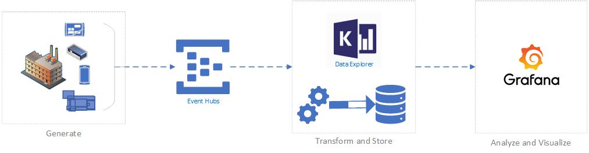

# High-scale Data Ingestion and Analysis with Azure Data Explorer

## Introduction

Azure Data Explorer (ADX) is a fast and highly scalable data exploration service for telemetry data.
This sample illustrates how to use ADX capabilities in an IoT scenario to transform and store time series in high velocity and volume.
As can be seen in the diagram below, the devices in our factory send out data into an Azure Eventhubs which is later stored in ADX. The final step is where we're using Grafana and other query tools to analyze the information we got.



The following sections follow the process outlined above, where each includes information and steps needed to have a full working scenario.

## Run the Sample

### Prerequisites

1. Access to an Azure account. If you do not have one, follow [this](https://azure.microsoft.com/en-gb/free/) to setup a free account.
1. [Azure CLI](https://docs.microsoft.com/en-us/cli/azure/install-azure-cli?view=azure-cli-latest)
1. Optional: Python and the [ADX library for Python](https://github.com/Azure/azure-kusto-python)

### Clone this repository

From your shell or command line run the following:

```bash
git clone https://github.com/Azure-Samples/kusto-high-scale-ingestion.git
```

### Environment Setup

The [Setup Environment](environment-setup/README.md) section will guide you to provision and configure Azure resources used on this sample.

### Generate Data

To simulate a manufacturing factory devices sending out metrics data, we used pepper-box - a kafka load generator plugin for jmeter.
This repository contains a modified implementation of pepper-box, supporting Kafka version 1.0 and later. It will send out json messages to Azure Event Hub for Kafka.

Read more on [Data Generator](data-generator/README.md)

### Transform and Store

Azure Data Explorer offers different ways to ingest data into the service. In this sample, we will ingest data directly from an Eventhubs, and transform it by using an Update Policy.

Read more on [Processing](processing/README.md)

### Analyze and Visualize

After collecting, transforming and storing the data, the next step is to visualize queries on top of the data. This sample uses Grafana.

Read more on [Analysis and Visualization](analyze/README.md)

## Cleanup

If you don't plan on using resources created for this sample like the Azure Data Explorer cluster you should delete them to avoid un-necessary charges. An easy way to do this would be to delete the resource group you created on the _Initial Environment Setup_ section.