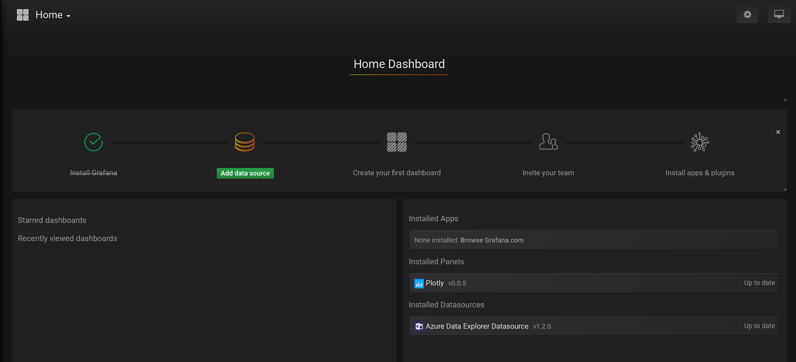
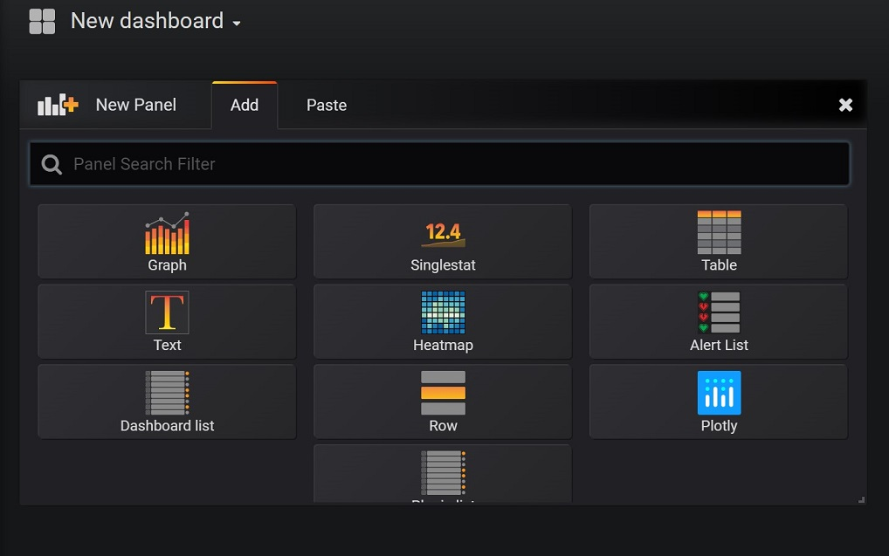
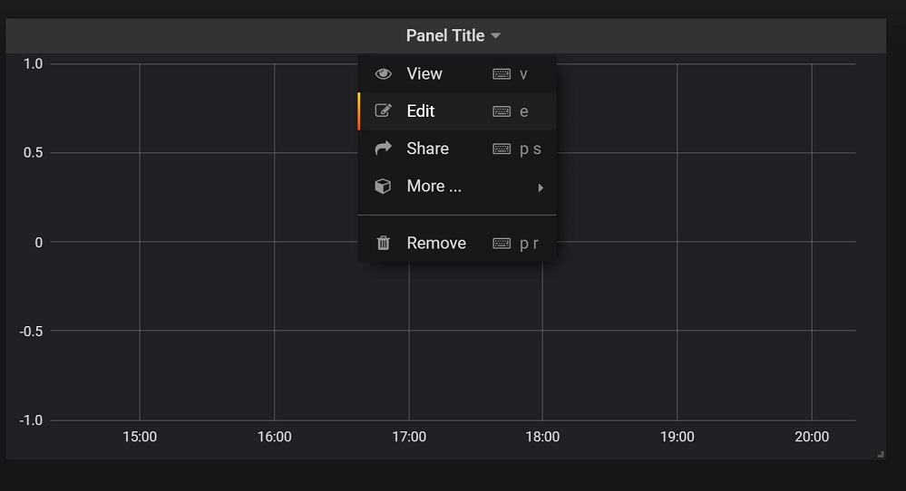
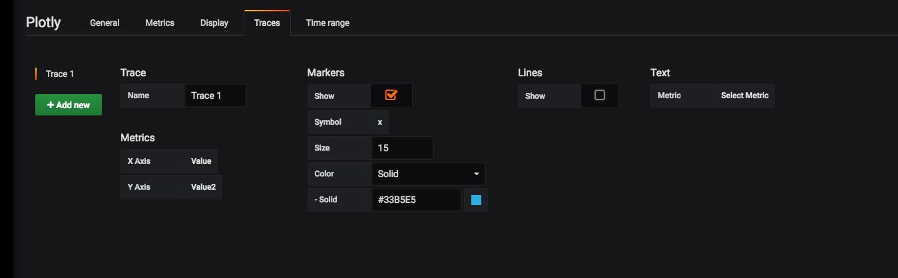

# Analyze and Visualize Data

Once you installed the environment and you have the data generator up and running,
use the following instructions to analyze and query the data, using [Grafana](https://grafana.com/).

## Installation

### Option 1: Using docker

1. Fetch the latest version of Grafana from Docker Hub:
    `docker pull grafana/grafana:latest`
1. Run Grafana and install the Azure Data Explorer and Plutly plugins with this command:

    ```bash
    docker run -d --name=grafana -p 3000:3000 -e "GF_INSTALL_PLUGINS=grafana-azure-data-explorer-datasource,natel-plotly-panel" grafana/grafana:latest
    ```

1. Open the browser at: http://localhost:3000 or http://your-domain-name:3000
1. Login in with username: `admin` and password: `admin`

    This ia an alternative command if you want to run Grafana on a different port than the default 3000 port:

    ```bash
    docker run -d --name=grafana -p 8081:8081 -e "GF_SERVER_HTTP_PORT=8081" -e "GF_INSTALL_PLUGINS=grafana-azure-data-explorer-datasource,natel-plotly-panel" grafana/grafana:master
    ```

    It is recommended that you use a volume to save the Grafana data in. Otherwise if you remove the docker container, you will lose all your Grafana data (dashboards, users etc.). You can create a volume with the [Docker Volume Driver for Azure File Storage](https://github.com/Azure/azurefile-dockervolumedriver).

### Option 2: Using Azure Container Instances

1. If you don't have a Resource Group, create one in your preferred location (in this example we used West Europe):

    ```bash
        az group create --name <myResourceGroup> --location eastus
    ```

1. Run the container with the following command:

    ```bash
    az container create --resource-group <myResourceGroup> --name grafana --image grafana/grafana:latest -e "GF_INSTALL_PLUGINS=grafana-azure-data-explorer-datasource,natel-plotly-panel" --ports 3000 --dns-name-label aci-grafana
    ```

1. Check the status of the instance with the following command:

    ```bash
            az container show --resource-group myResourceGroup --name grafana --query "{FQDN:ipAddress.fqdn,ProvisioningState:provisioningState}" --out table
    ```

## Add a data-source

After starting and connecting to your Grafana instance you should add a data-source:

1. Click on 'Add Data Source' 
1. Choose 'Azure Data Explorer' 
1. Follow the instructions [here](https://github.com/grafana/azure-data-explorer-datasource#configuring-the-datasource-in-grafana) to configure the data source.

## Dashboard

1. Create a time-based graph using a simple query
    Click on "add Dashboard" and choose "Add Panel", then select "Graph".
    
    Then, click on the graph name, and then edit:
    
    In the metrics tab add your query:

    ```kusto
    target
    | where $__timeFilter(Timestamp)
    | summarize count() by bin(Timestamp, 30sec)
    | order by Timestamp
    ```

    Save the graph.

2. Create a scatter plot panel in your Grafana dashboard

    A scatter plot is a diagram using Cartesian coordinates to display values for typically two variables for a set of data. The motivation is the ability to see the value of Sensor X over Sensor Y.
    The scatter plot is made possible by the [Ployly plugin](https://grafana.com/plugins/natel-plotly-panel) which was installed as part of the docker image.

    Go to your dashboard and click add panel and choose plotly.
    Once it was added to your dashboard got to the panel and click edit.
    In the metrics tab, add your query:

    ```kusto
    target
    | where  $__timeFilter(Timestamp)
    | take 1000
    | extend Value2 = Value * 2
    | project Value, Value2, Timestamp
    ```

    * Since our data is generated randomly, we add the times 2 to the query to make the chart more interesting.

    Define the axes under `Traces` tab as follows:  
      
    Save the panel

## Next Steps

You're done!
Go on to the [main section](../README.md) to do some cleanup.