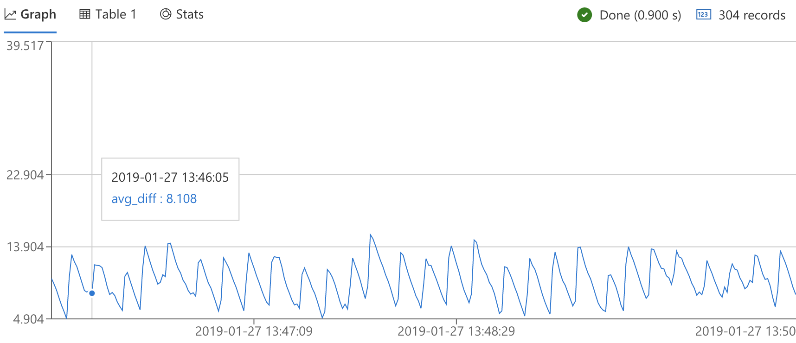
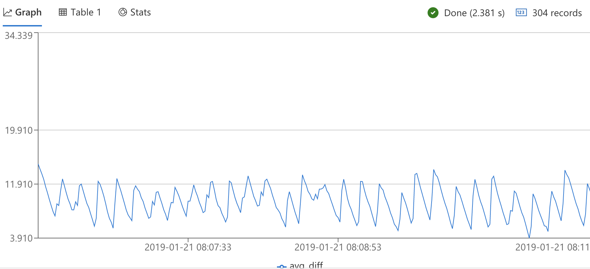

# Transform and Store

In the previous section we worked on generating data and ingesting it into the `landing` table.
Now we are ready to expand the raw data received from the devices into the `target` table and make it easy to query. Following that, we will optimise our cluster for performance and lower latency.

## Define an Update policy

As we saw before, the data points are compacted and sent in arrays, making it hard to query.
We want to "flatten" the arrays so that it will be easy to work with and query. In order to do that we use an [update policy](https://docs.microsoft.com/en-us/azure/kusto/management/update-policy) which is somewhat similar to a SQL trigger - a query that runs when data is ingested into a source table, with the result saved to the a target table.

### Option 1: Using Azure Portal

1. Go to your database in Azure Data Explorer
1. Create the target table:

    ```kusto
    .create table target (Timestamp: datetime, SensorName: string, Value: real, WorkOrderId: string, MachineId: string)
    ```

1. Create a function in Azure Data Explorer to contain the query that expands the data

    ```kusto
    .create-or-alter function with (folder = "", docstring = "", skipvalidation = "true") SourceDataParsing() {
    landing
        | extend workOrderId = tostring(rawdata['workOrderId'])
        | extend machineId = tostring(rawdata['machineId'])
        | mvexpand sensors = rawdata['data'] to typeof(string) limit 2000
        | extend j = parse_json(sensors)
        | extend name = tostring(j.name)
        | extend timestamp = j.timestamp
        | mvexpand value = j.values to typeof(double), t1 = j["timeDelta"] to typeof(long) limit 2000
        | extend Timestamp = datetime(1970-01-01) + ((t1 + timestamp) * 1micros)
        | project Timestamp , SensorName = name , Value = value, WorkOrderId = workOrderId, MachineId = machineId
    }
    ```

    For more information about Azure Data Explorer functions [click here](https://docs.microsoft.com/en-us/azure/kusto/management/functions)
1. Alter your target table update policy:

    ```kusto
    .alter table target policy update "[{\"IsEnabled\": true,\"Source\": \"landing\",\"Query\": \"SourceDataParsing()\",\"IsTransactional\": true,\"PropagateIngestionProperties\": false}]"  

    ```

    Notice that `IsTransactional` set to true due to zero retention policy defined in the next step.

### Option 2: Using Python

You can also run the following script to create the tables and the update policy automatically:

1. Go to processing/kusto/ directory

    ```bash
    cd processing/kusto/
    ```

1. Run the script

    ```bash
    python3 processing-objects-setup.py --cluster CLUSTER_URL --database DATABASE_NAME
    ```

## Zero retention policy

The retention policy defines how long the data will be stored in the table.
In our scenario, we have data come in to the `landing` table but we don't need to save it since we transform it immediately with an update policy and save it to the `target` table. Setting the retention policy to zero on the `landing` table will cause it to not be committed and persisted to Azure Storage, leading to better performance and lower latency. This setup doesn't impact the retention or persistance of data to the `target` table where everything will remain as usual.

For more information about retention policy [click here](https://docs.microsoft.com/en-us/azure/kusto/concepts/retentionpolicy)

Set zero retention policy on the `landing` table:

```kusto
.alter-merge table landing policy retention softdelete = 0d recoverability = disabled
```

Notice that `recoverability` must be disabled since the ingested data is not committed to the landing table and therefore is not recoverable.

For comparison, we ran the same test load with zero retention policy and without it, and saw that on average ~2 sec were saved which is around 20% improvement in total latency.
The following graphs shows ingestion latency with zero retention policy and without it:

With default retention policy:


With zero retention policy:


## Configure your cluster ingestion settings

The data management (DM) component within ADX is responsible (among other things) on the communication with Event Hubs and the preparation data to be ingested (indexed, stored, etc.) by the engine component. You can learn more about ADX inner working [here]().

Data is fetched from EventHubs in small chunks, saved in intermediate blobs and then sent for ingestion. This process is controlled by several parameters that determine the timing and size of each ingestion action:

1. TargetFileSizeInMB
1. MaximumAggregationNumberOfFiles
1. MaximumAggregationTimeSpan

Each time a blob size reaches the `TargetFileSizeInMB` a new one is created.
These blobs are grouped together until `MaximumAggregationTimeSpan` has passed or `MaximumAggregationNumberOfFiles` were created, which is when the command is sealed and the blobs are sent for ingestion.

__Altering these parameters requires special permissions which aren't usually available to end users. You will need to open a support ticket [here](https://aka.ms/gaia)__

 To achieve lower ingestion latency in this sample, the parameters were changed as follows:

* __TargetFileSizeInMB__ = 2
     The default value is 1000
* __MaximumAggregationTimeSpan__ = 10 seconds
     The minimum value is 10 seconds and the default value is 5 minutes.
     Notice that if the time is short, consider the value of TargetFileSizeInMB.
     If the time passed but the file did not reach its limit the ingestion will not be executed.
* __MaximumAggregationNumberOfFiles__ = 10
    The default value is 500
    This parameter is important for concurrency. Consider cluster capabilities to set it for optimal performance.

Setting parameters that way allowed creating groups of small files that could be processed quickly and concurrently.
This allowed has to reach an overall latency of 8.3 seconds from the time that data has been created till the time it reached the target table.

### Considerations

Each time the ingestion command is sealed and executed, a new extend (shard) is created. Extents are later merged and optimised in the background. To read more about extents [click here](https://docs.microsoft.com/en-us/azure/kusto/management/extents-overview).

When small and fast ingestion commands are made, data will reach the table much quicker, but many extents will be created in the process.
The changes made above to the cluster configuration may affect query performance, cpu, networking, storage transactions and caching. Ultimately this can also impact the cost of the solution.

## Next Steps

Once you have completed this section, go on to the next one: [Analyze and Visualize Data](../analyze/README.md)